## One to One Mapping

### Images

- Entity Lifecycle
  
  

* @OneToOne - Cascade Types
  

* @OneToOne - Bidirectional
  mapped by :
  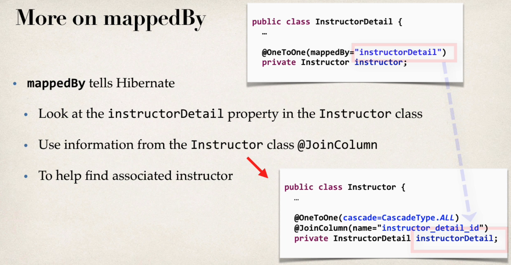

## One to Many Mapping(Bidirectional)

\*Cascade Delete (avoid mostly)
ex:
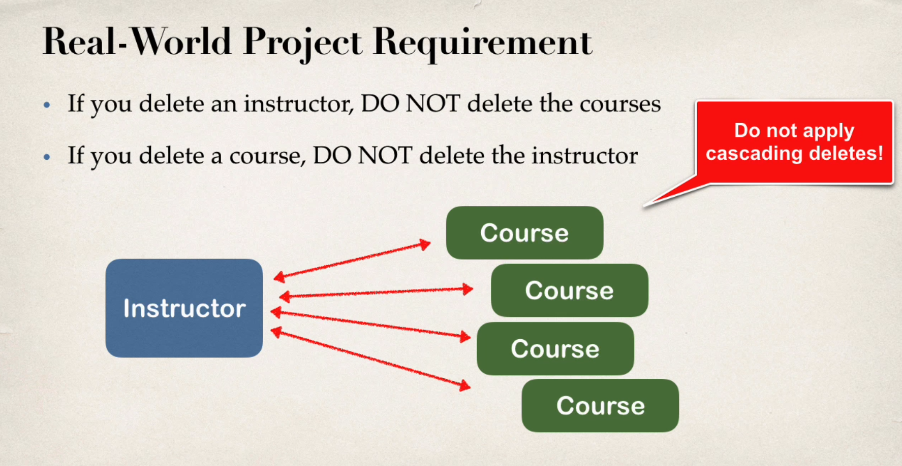

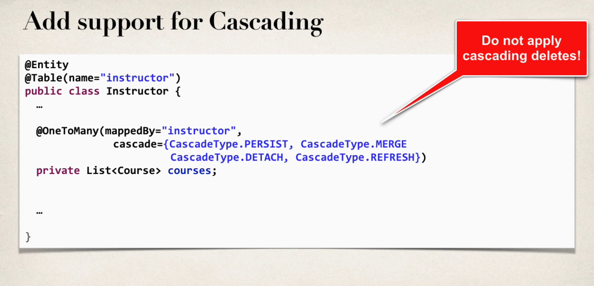

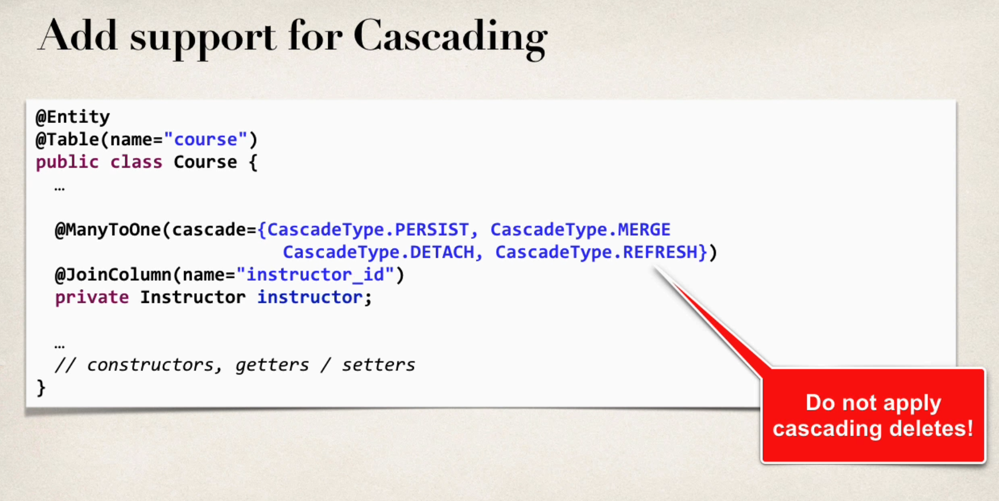

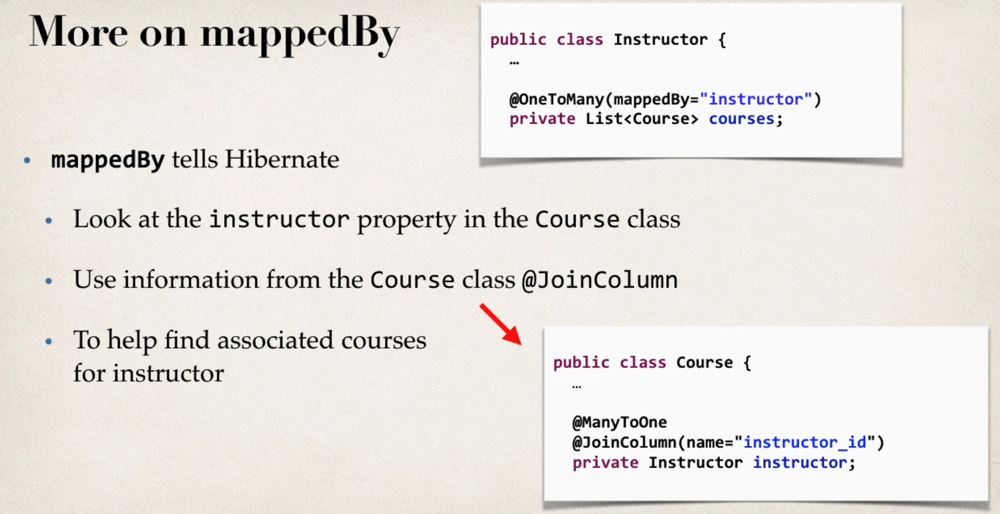

## Fetch Types for diffferent mappings

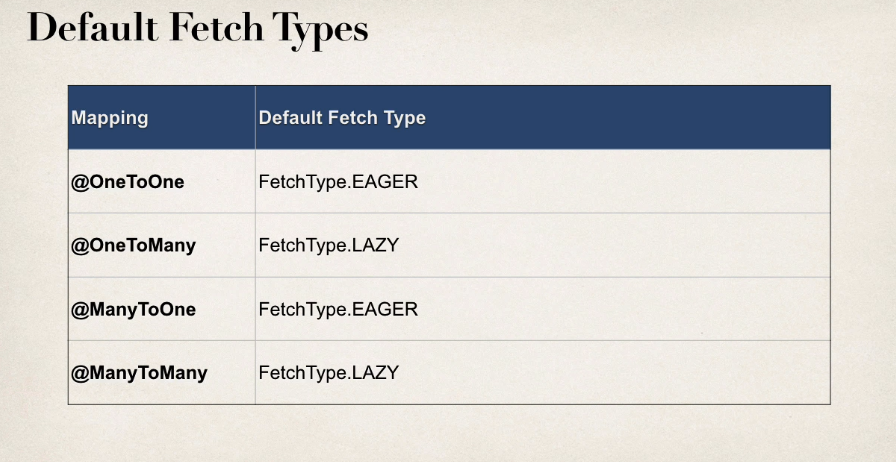

## One to Many Mapping(Unidirectional)

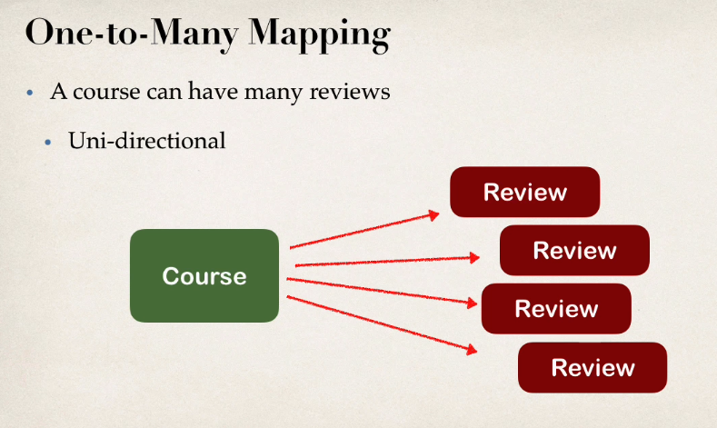

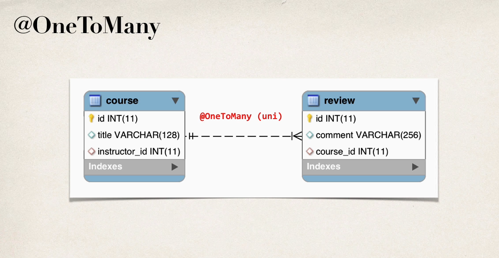

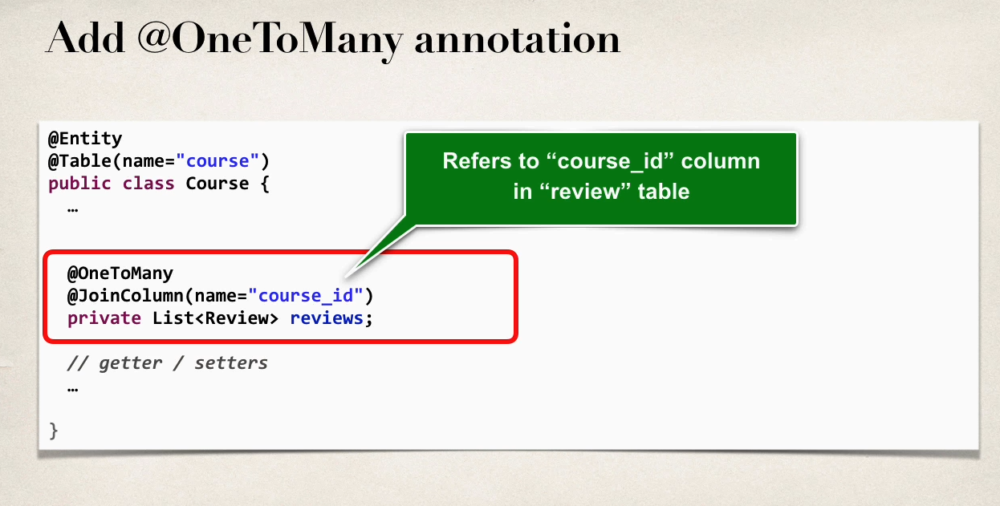

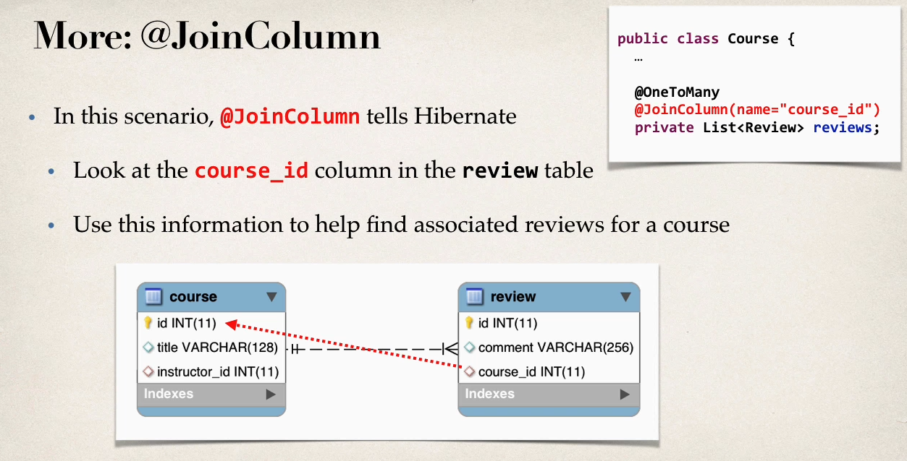

## Many to Many Mapping

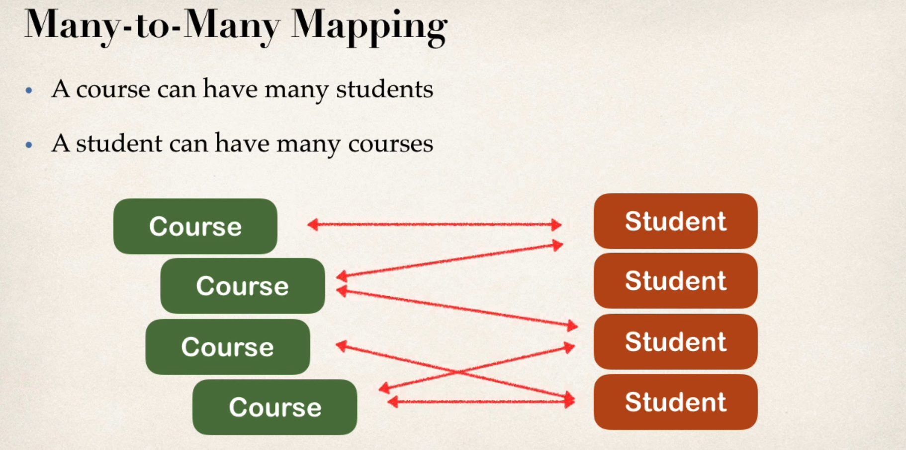

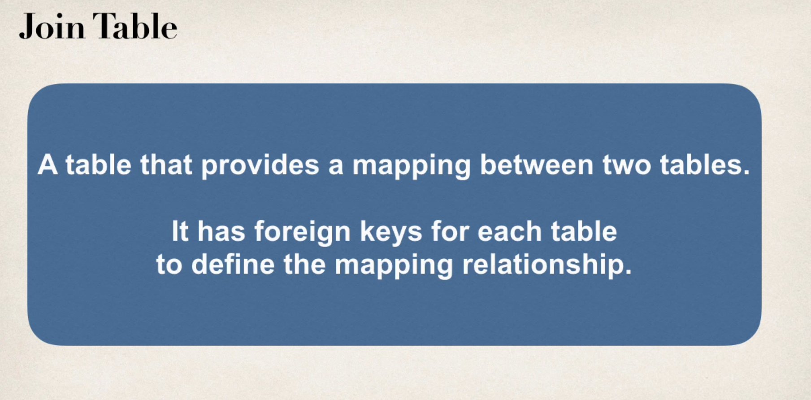

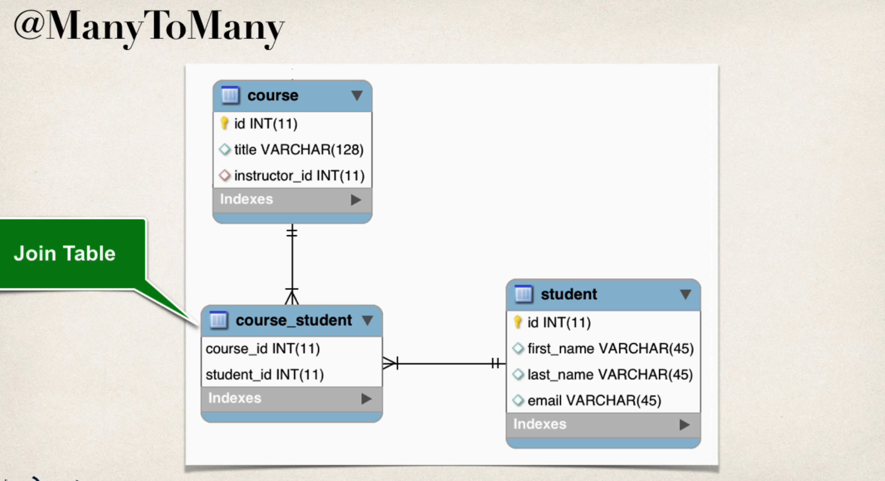

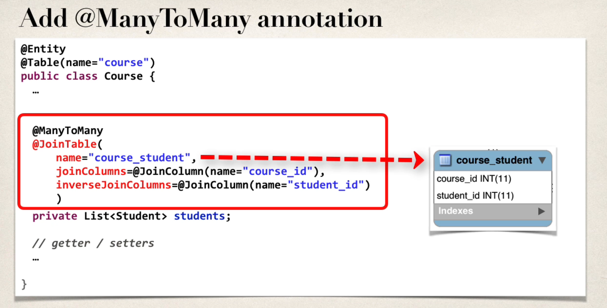

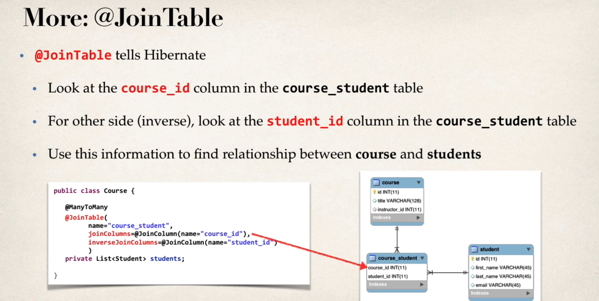

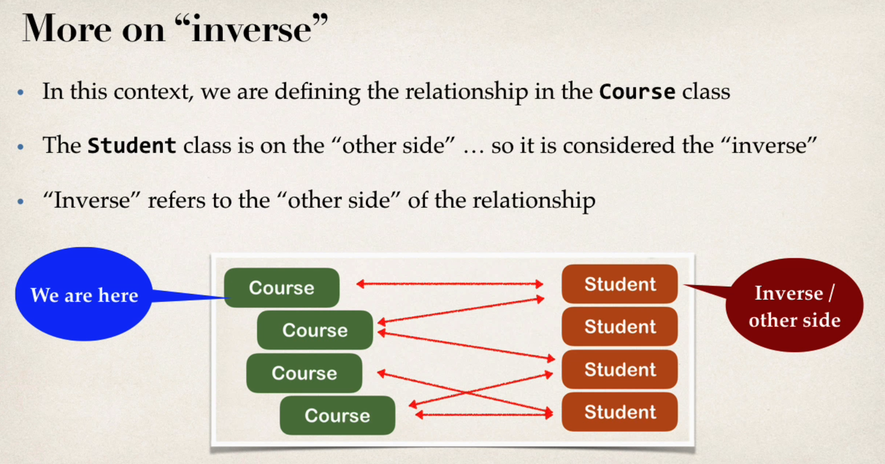

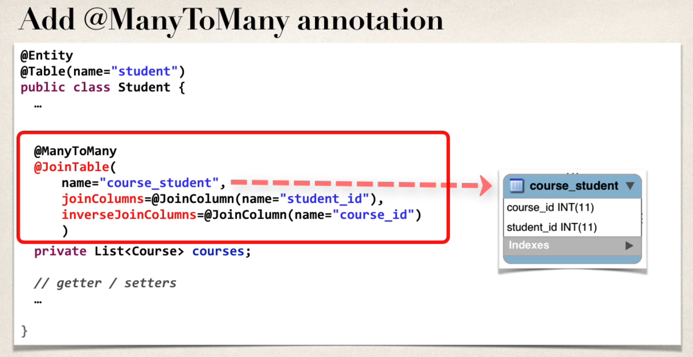

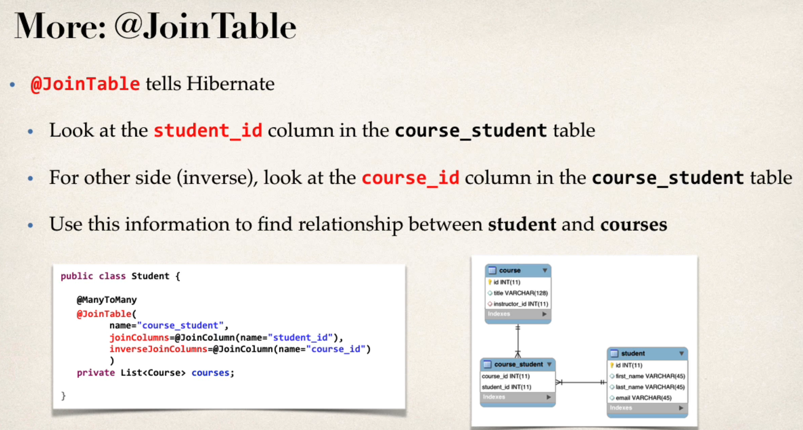
