# Getting Started

### Reference Documentation
For further reference, please consider the following sections:

* [Official Apache Maven documentation](https://maven.apache.org/guides/index.html)
* [Spring Boot Maven Plugin Reference Guide](https://docs.spring.io/spring-boot/docs/3.2.4/maven-plugin/reference/html/)
* [Create an OCI image](https://docs.spring.io/spring-boot/docs/3.2.4/maven-plugin/reference/html/#build-image)

### AOP: Pointcut Expressions
* Pointcut : A predicate expression for where advice should be applied.

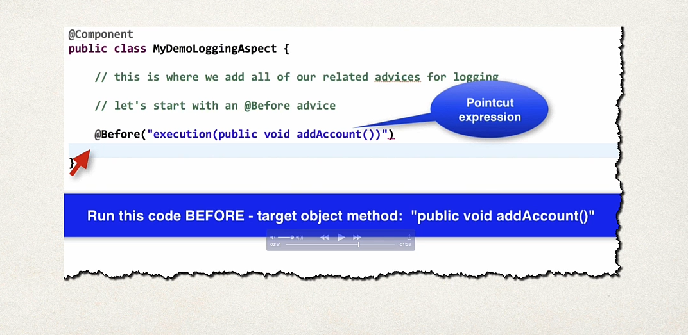

* Pointcut Expression Language

Modifiers: (Spring AOP only supports public)
Return type: void,boolean,String,List<Customer>,....
Declaring type: the class name
Method Name: method name to match and parameters types to match
Throws: exception types to match

* Examples: 
    
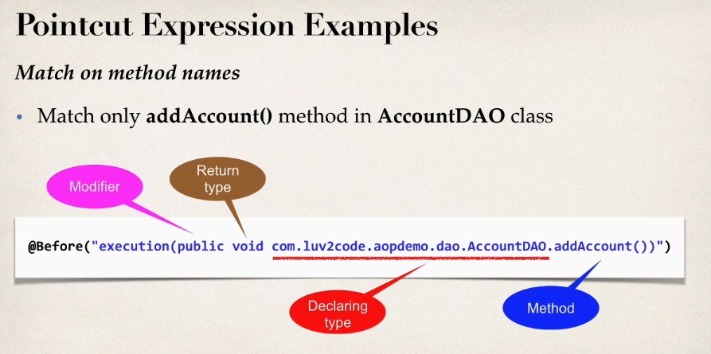
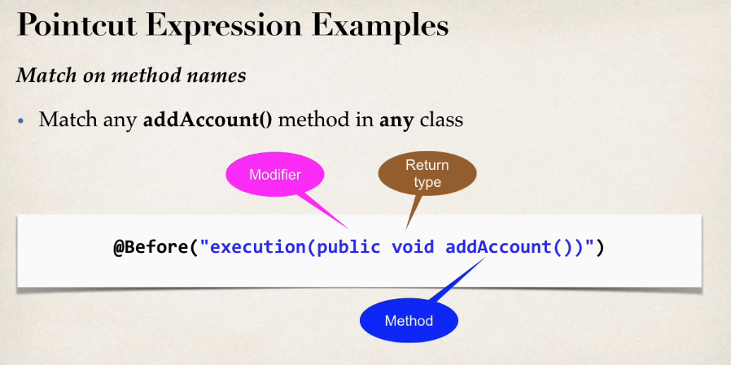
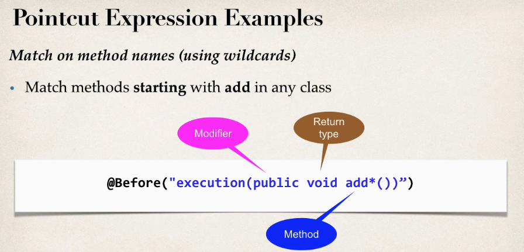
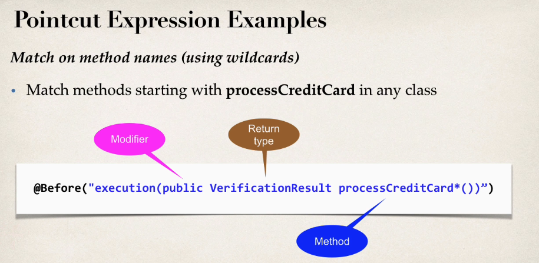
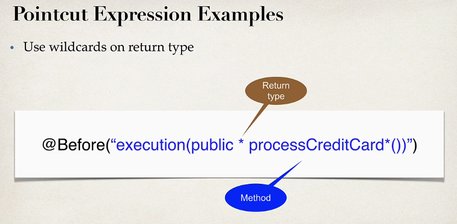
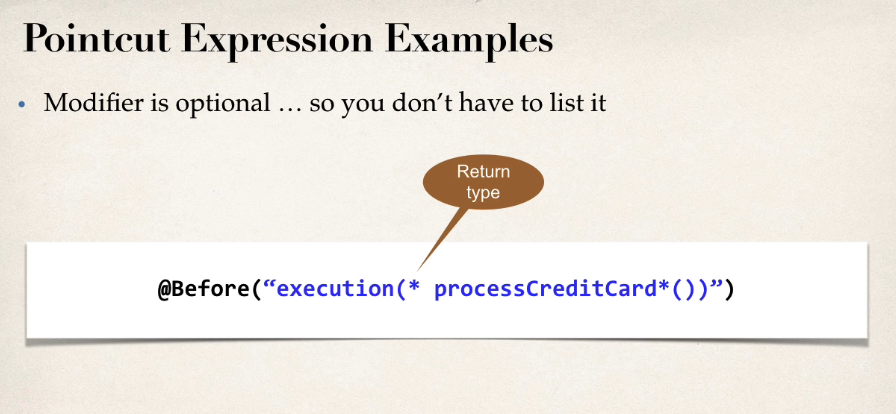

* Parameter Pattern Wildcards
 
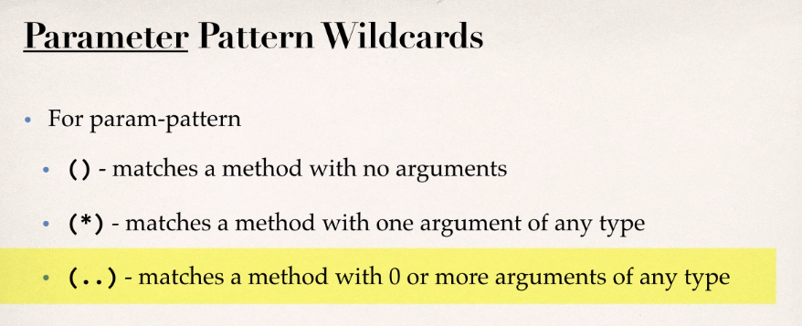
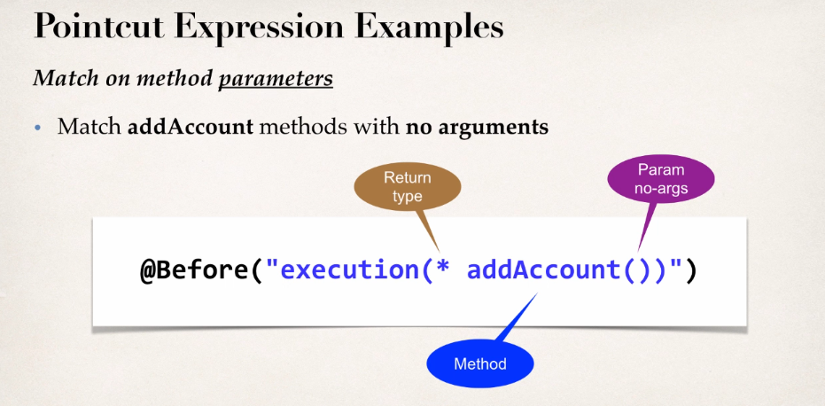
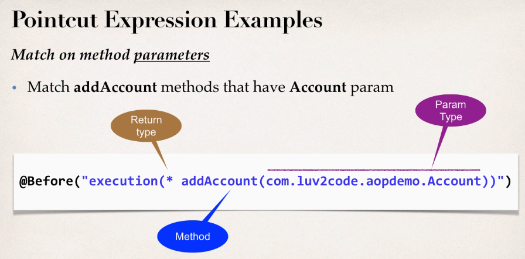
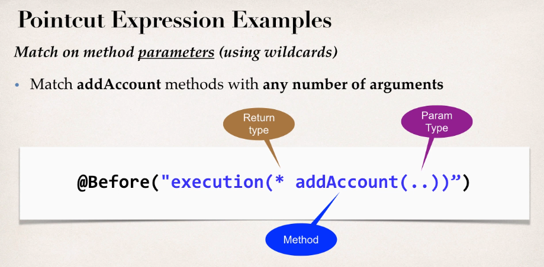
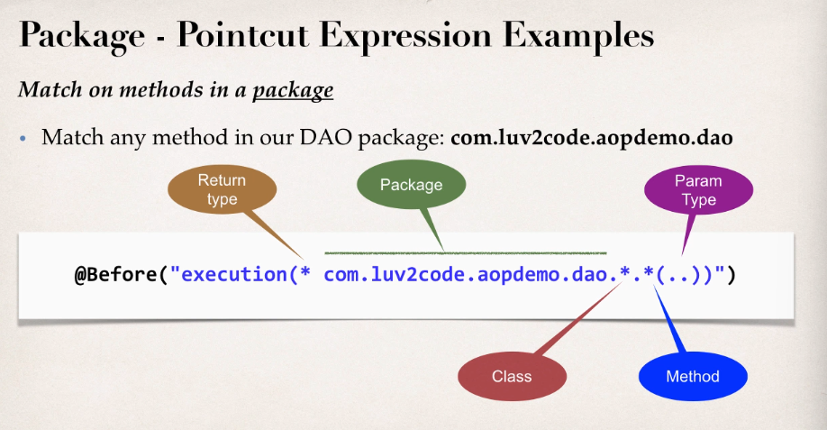

* Pointcut Declarations 

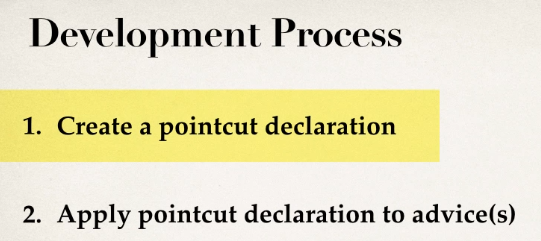
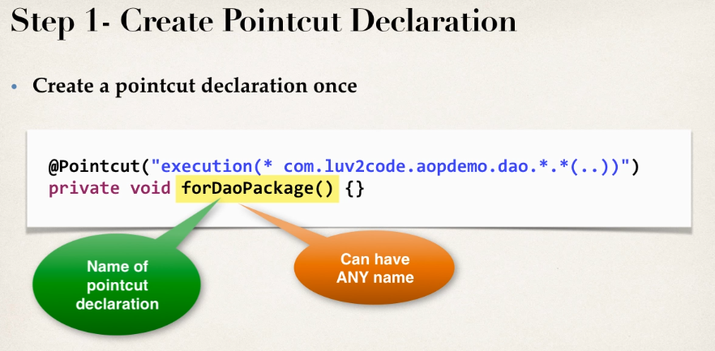
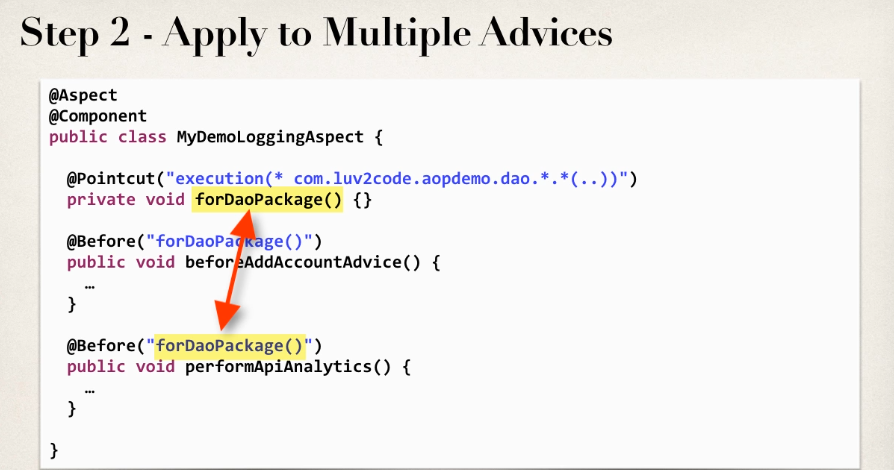
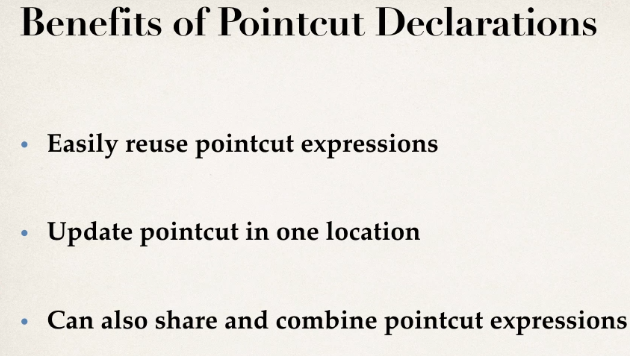