# Getting Started

### Reference Documentation
For further reference, please consider the following sections:

* [Official Apache Maven documentation](https://maven.apache.org/guides/index.html)
* [Spring Boot Maven Plugin Reference Guide](https://docs.spring.io/spring-boot/docs/3.2.4/maven-plugin/reference/html/)
* [Create an OCI image](https://docs.spring.io/spring-boot/docs/3.2.4/maven-plugin/reference/html/#build-image)

### AOP: AfterReturning advice

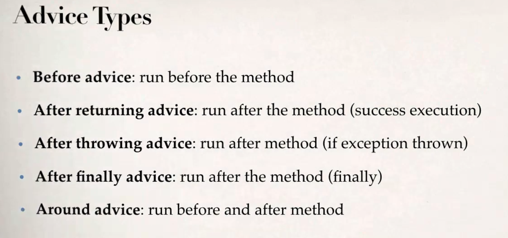

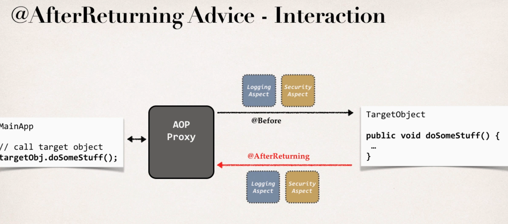

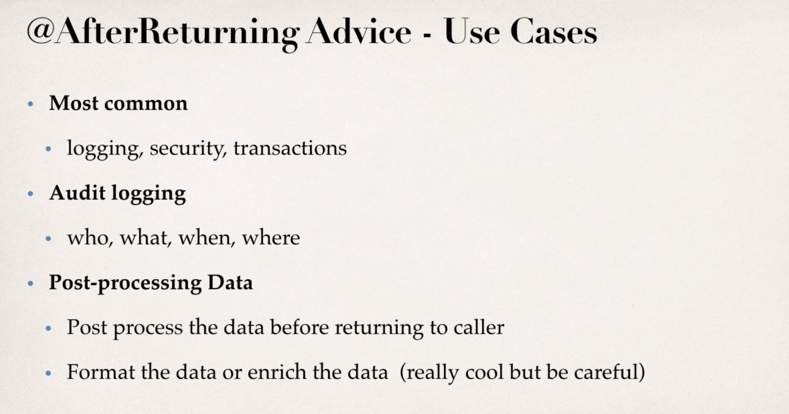

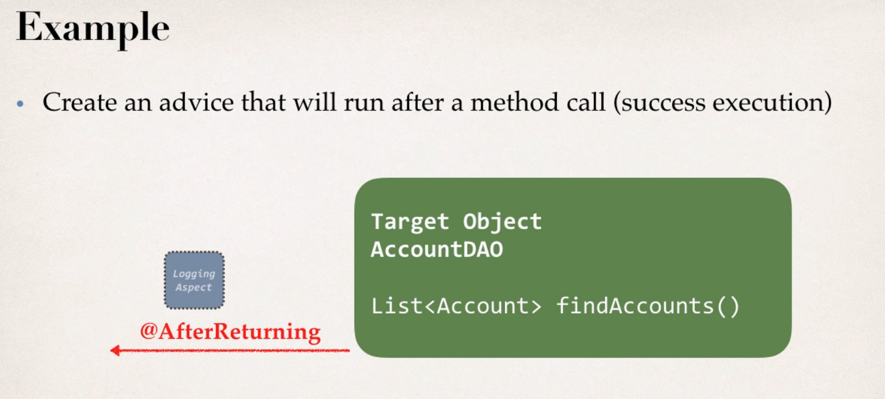

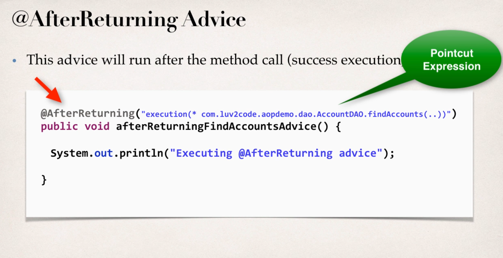

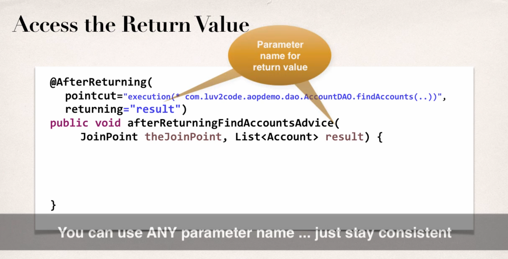

### AOP: AfterThrowing advice

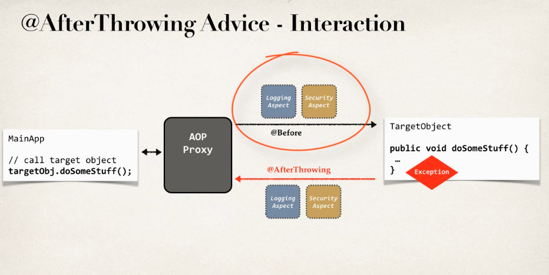

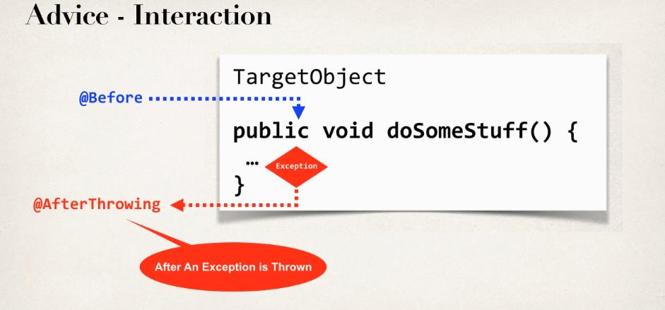

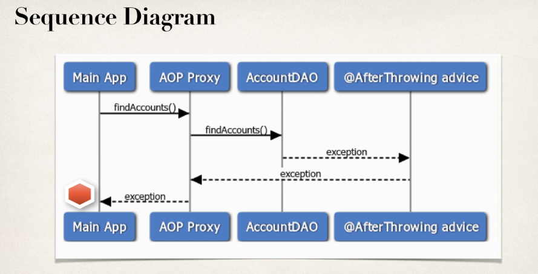

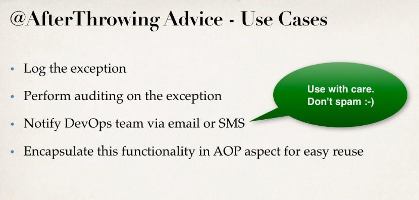

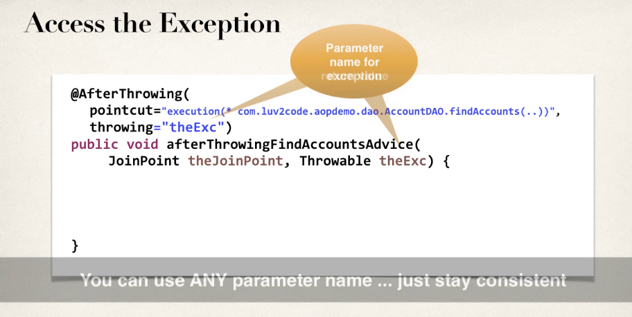

### AOP: After (finally) advice

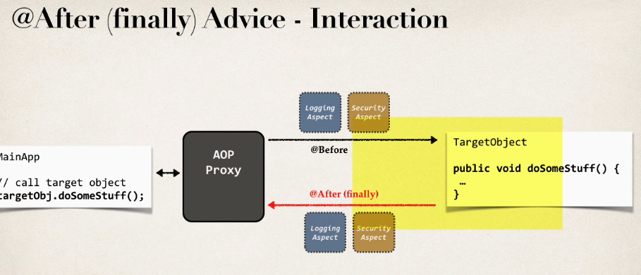

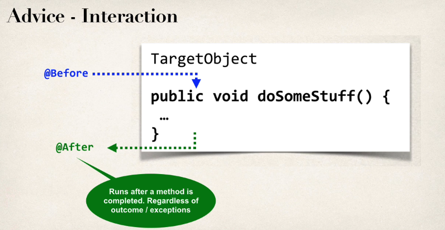

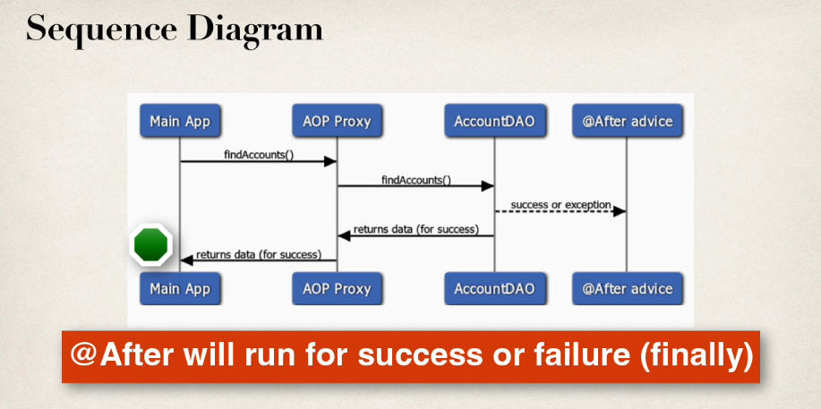

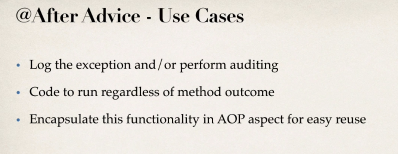

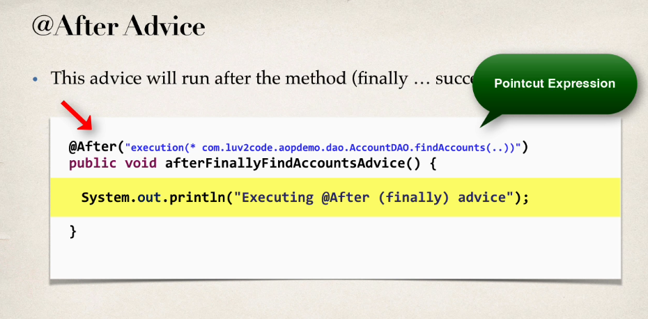

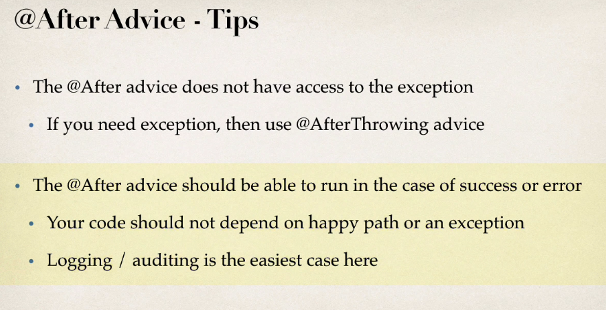

